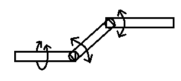

16. 我们知道，对一个数据进行重复测量并取平均值可以减小偶然误差，下面对这一原理进行探讨。假定存在一个测量工具可以测量准确值$x_0$问整数的一个物理量，且测多一个单位和测少一个单位的概率均为$\frac{1}{2}$。用该工具测量一个体系$n$次，得到数据$x_1、x_2、\dots、x_n$，且这些数据的均值为$\overline{X_n}$。

    (1) 求证：$a=\overline{X_n}$时$\sum_{i=1}^n(x_i-a)^2$取最小值；

    (2) 求证：随机变量$\varepsilon_n^2=(X_n-x_0)^2$的期望随n递减；

    (3) 2次测量后，体系受到扰动，$x_0$可能发生改变，于是又进行了两次测量，发现这两次测得数据的平均值与扰动前测得数据的平均值相等，因而判断$x_0$没有发生变化，求这一判断错误的概率。

17. 如图，xOy平面内存在一个边长为m、n的矩形网格，每个小格均为边长为1的均为边长为1的正方形。先随机选取一个小格，在其中心放置一点P，再使P分别在x、y轴方向是进行两轮游走。每轮游走中，P先后沿坐标轴正、负方向等可能地移动0至2格，则P最终仍在网格内的概率为___

18. $f(x)=log_ax-a^x$

    (1) $a\in [e^{-e},1)\cup(1,+\infty)$，关于$x$的方程$x=a^x$、$x=log_ax$和$a^x=log_ax$的根分别组成集合A、B、C，求证：$A=B=C$；

    (2) $f(x)\lt0$，求$a$的取值范围；

    (3) $a\in(0,1)$，求$f(x)$零点个数的可能取值组成的集合。

19. 为适应田间起伏的路面，农用机械有时会采用如图所示的万向轴进行传动。OA、OB、OC为三段不可变形的直杆（半径可以忽略），长度均为20。每两段杆间有一活动连接，可按一定方向转动，但限制任意两杆间夹角$\alpha、\beta$不大于$\frac{\pi}{6}$。认为OA杆始终水平，且OA杆可以以自身为轴自由转动。则A、C两点间最大高度差为___。AB杆能扫过的区域组成一个几何体，该几何体体积为\_\_\_。

    

20. 电子计算机推广之前，很多复杂的计算时借助对数表完成的。以下是一个常用对数表的一部分：

    | x    | 2        | 3        | 7        | 11       | 13       | 17       | 19       |
    | ---- | -------- | -------- | -------- | -------- | -------- | -------- | -------- |
    | lg x | 0.301030 | 0.477121 | 0.845098 | 1.041393 | 1.113943 | 1.230449 | 1.278754 |

    以此计算$2^{2023}=$___。